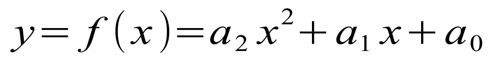
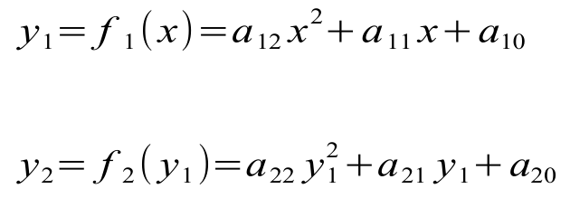
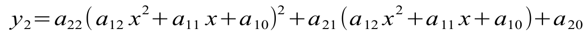
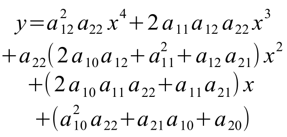
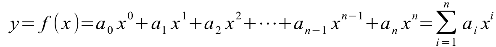

# PHP auto gradient descent

Example:

	$inputs = [[0, 0], [0, 1], [1, 0], [1, 1]];
	$outputs = [[0], [1], [1], [0]];
	$model = new Model();
	$model->add(new Layer(2, 2));
	$model->add(new Layer(2, 1));
	for ($j = 0; $j < 1000; $j++) {
	    foreach ($inputs as $i => $input) {
	        $out = $model->apply($input);
	        $error = $model->optimize($outputs[$i], 0.02);
	        echo "Loss = ".sprintf("%.6f", $error).PHP_EOL;
	    }
	}
	foreach ($inputs as $i => $input) {
	    $out = $model->apply($input);
	    echo $out[0].PHP_EOL;
	}
	echo "Finish".PHP_EOL;

No activation function, just:

If there are 2 layers:

so:

=>

If a great many of layers:

